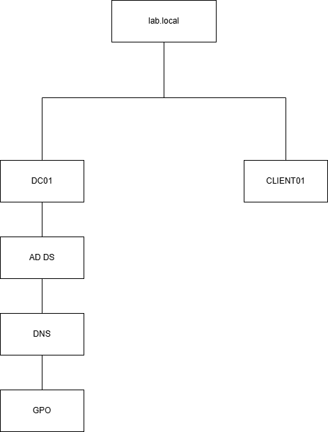
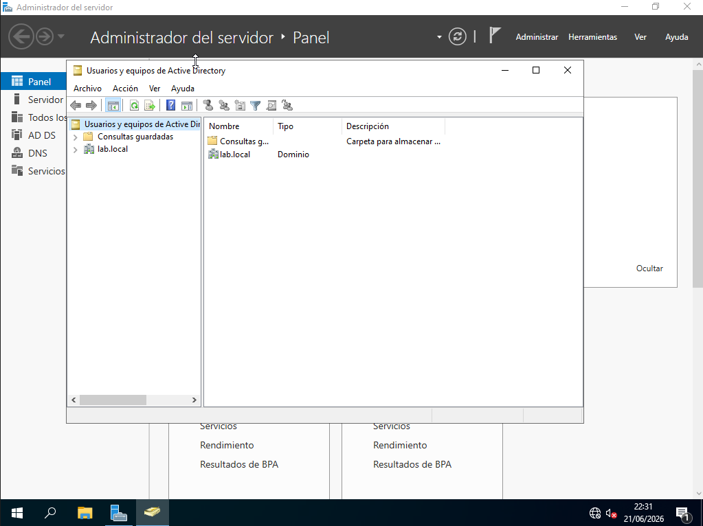
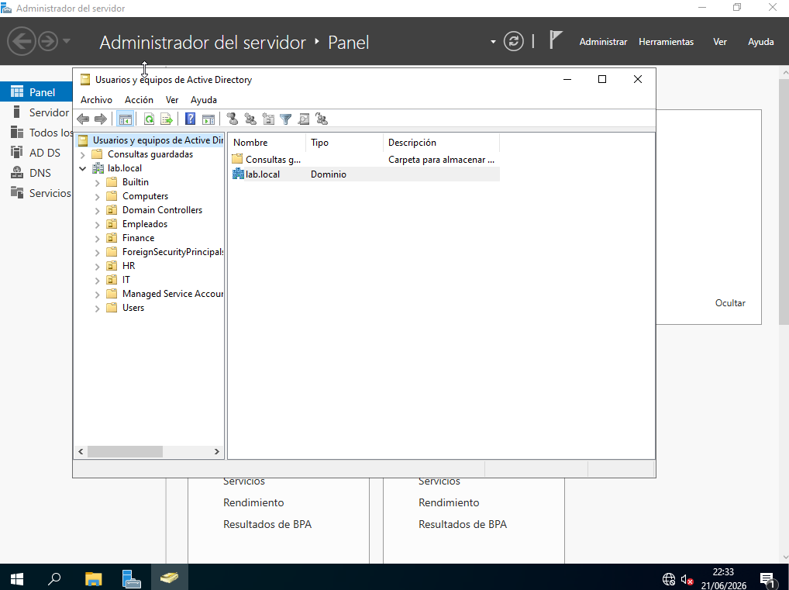
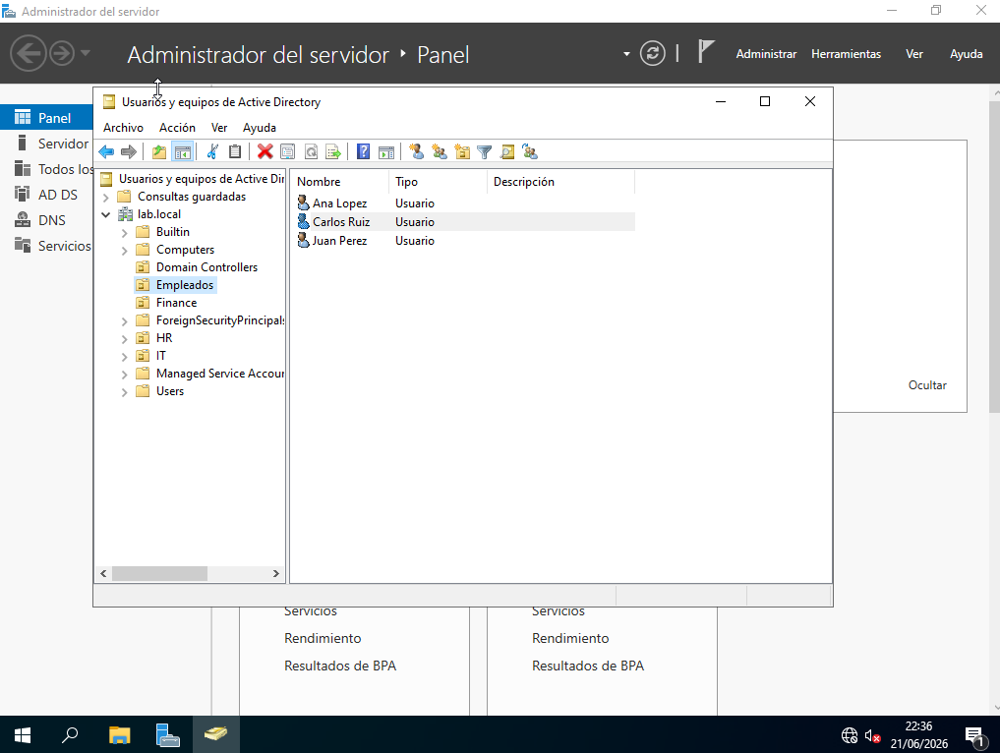
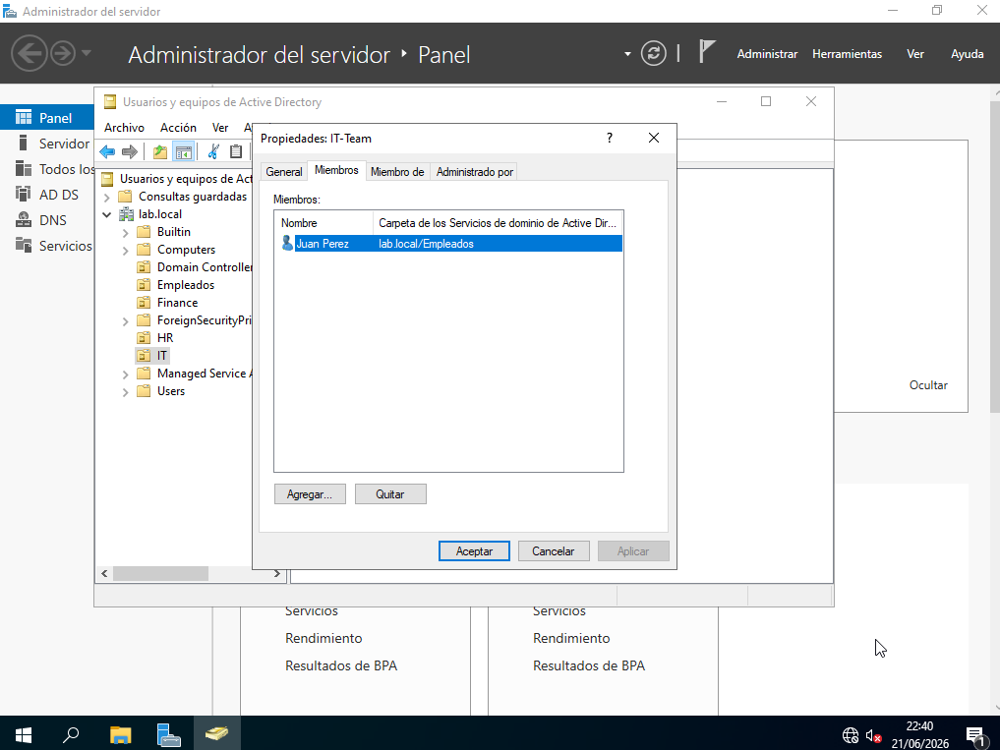
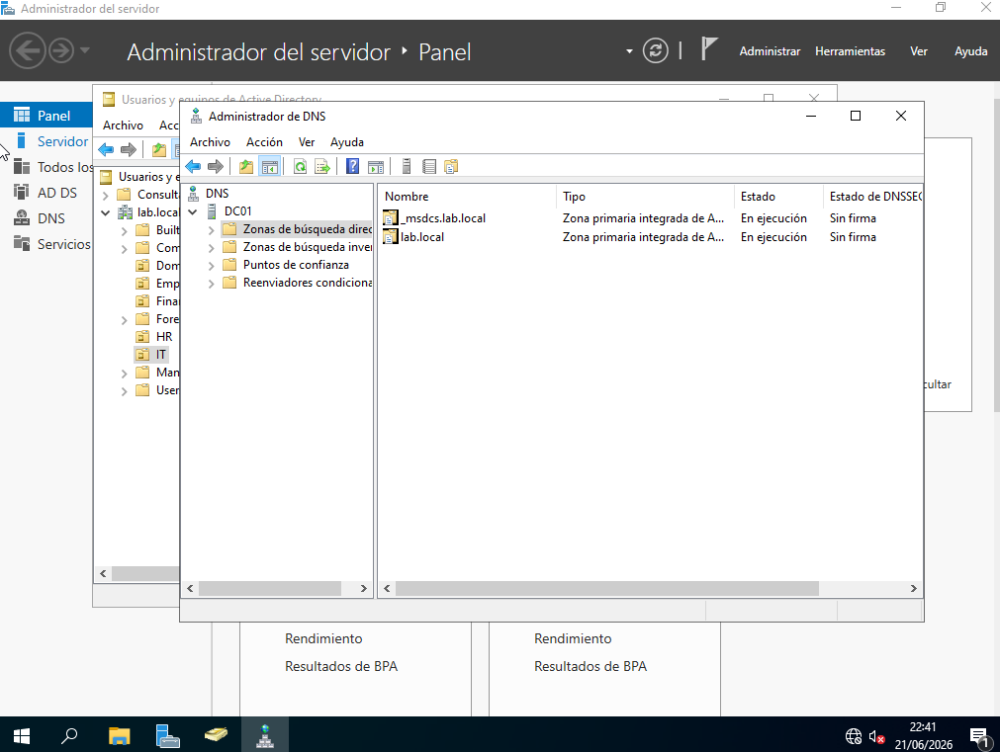
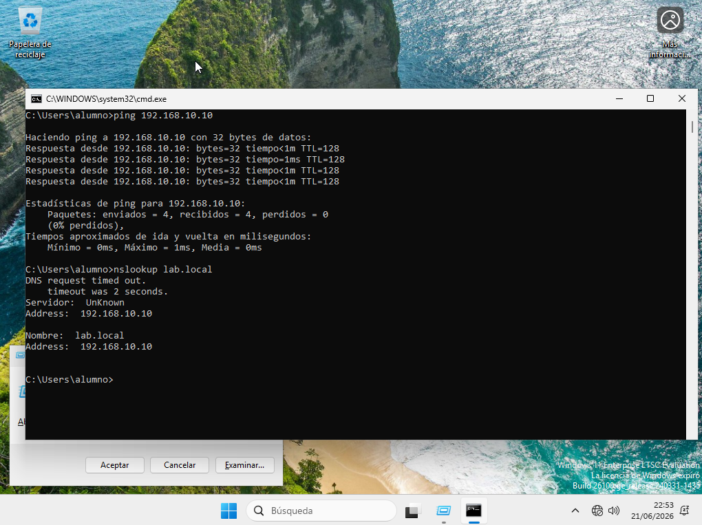
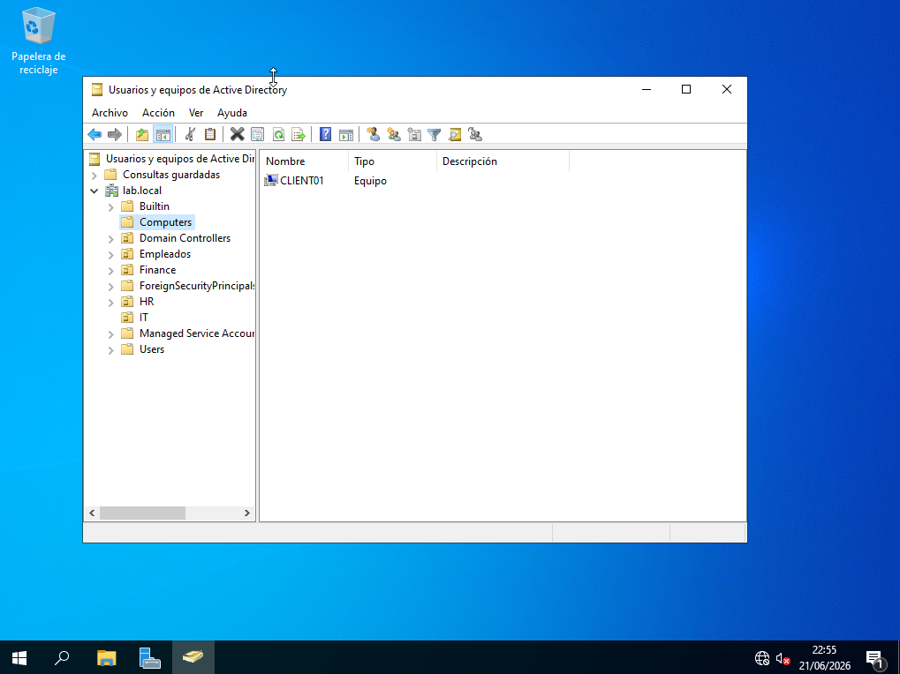
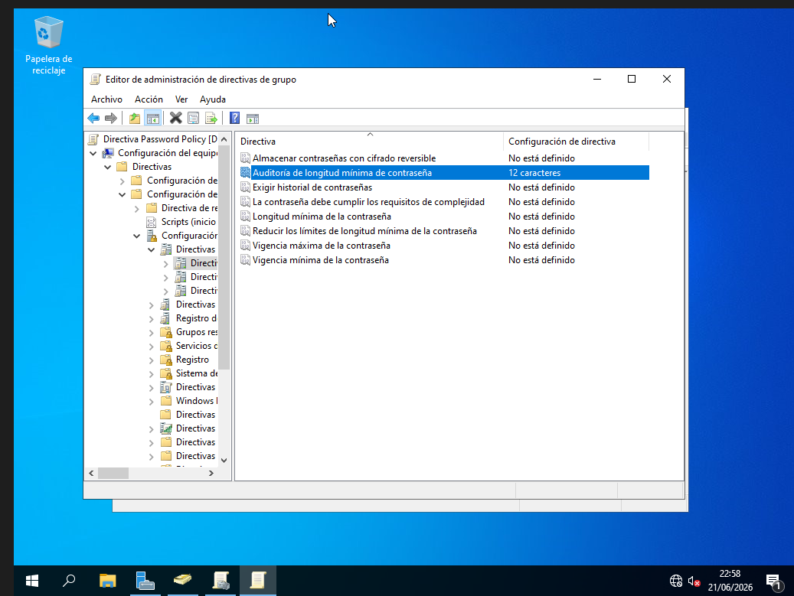

# Active Directory Lab

Enterprise-style Active Directory laboratory built for learning Windows administration, identity management, and security fundamentals.

## Environment

* Windows Server 2022
* Windows 11 Pro
* Active Directory Domain Services
* DNS
* Group Policy Management

## Objectives

* Deploy an Active Directory domain
* Create and manage users
* Create and manage groups
* Join clients to the domain
* Configure Group Policies
* Validate DNS functionality
* Practice Active Directory administration

## Domain Information

Domain:

lab.local

Domain Controller:

DC01

Client:

CLIENT01

## Diagrama

## Screenshots

### Domain Creation

### Organizational Units

### Users

### Groups

### DNS

### Client Connectivity

### Domain Computers

### Group Policy

## Skills Demonstrated

* Active Directory Administration
* DNS Configuration
* Group Policy Management
* User and Group Management
* Domain Administration
* Windows Server Management
* Identity and Access Management

## Author

Jonatan Arevalo
